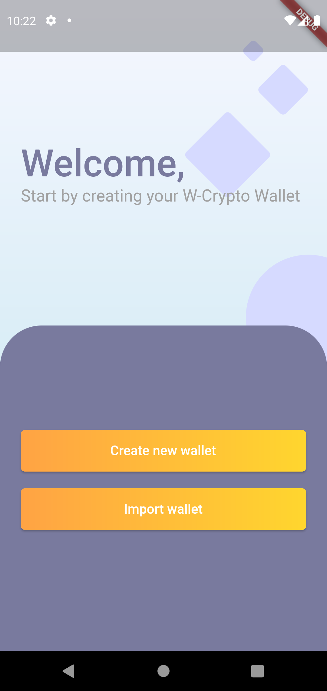
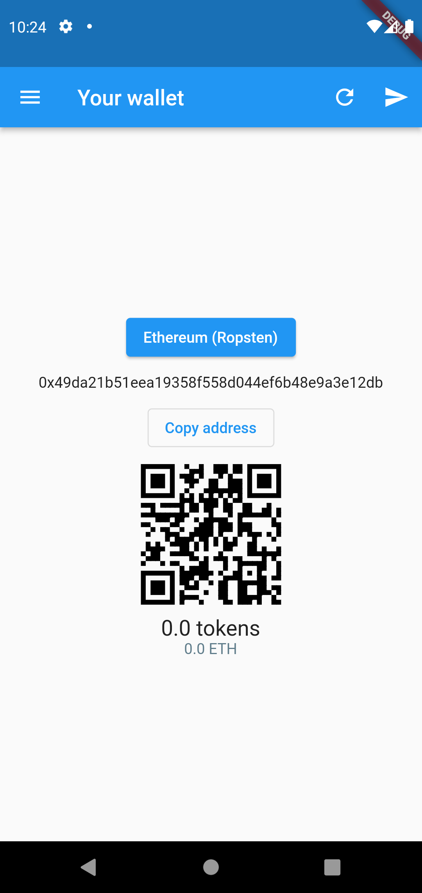
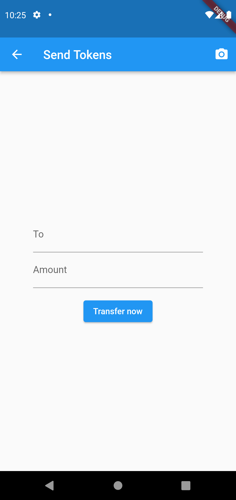

# WiiQare ETH wallet

## How to install

- Install [Flutter](https://docs.flutter.dev/get-started/install) and all its dependencies
- Clone this repository (`git clone https://github.com/WiiQare/wiiqare_crypto.git`)
- Open your terminal and navigate to the cloned directory
- Connect your Android phone with 'USB debugging' mode enabled
- Run the app using `flutter run`

## Screenshots

## Credit

This project is a clone of another Flutter project - [https://github.com/allanclempe/ether-wallet-flutter](https://github.com/allanclempe/ether-wallet-flutter)
